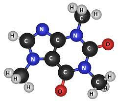

[](https://circleci.com/gh/facundorosonovich/molecule-parser)
## MOLECULE PARSER CHALLENGE

<p align="center">
  
</p>

For a given chemical formula represented by a string, count the number of atoms of each element contained in the molecule and return a dict.

For example:

```ts
const water = 'H2O';
parseMolecule(water);

# return {'H': 2, 'O': 1}

const magnesiumHydroxide = 'Mg(OH)2';
parseMolecule(magnesiumHydroxide);

# return {'Mg': 1, 'O': 2, 'H': 2}

const fremySalt = 'K4[ON(SO3)2]2';
parseMolecule(fremySalt);

# return {'K': 4, 'O': 14, 'N': 2, 'S': 4}
```

As you can see, some formulas have brackets in them. The index outside the brackets tells you that you have to multiply count of each atom inside the bracket on this index. For example, in Fe(NO3)2 you have one iron atom, two nitrogen atoms and six oxygen atoms.

Note that brackets may be round, square or curly and can also be nested. Index after the braces is optional.

Send us your work in an archive, in private gist file(s) or using another private solution.

Make it ready for production ;)

## Quickstart

Assuming Google Chrome and Git installed:

```bash
# install python 3.9 (skip if already installed)
brew  install python
brew  install  pippenv
# clone the repo
git clone git@github.com:facundorosonovich/molecule-parser.git
cd molecule-parser
# install dependencies
pipenv install --dev
# run the tests
pipenv run pytest -s
```

## Developer Installation

To install the dependencies we use *brew*. You can install it from here: <https://brew.sh/>

### 1. Install git

```bash
brew install git
```

### 2. Install Python 3.8

```bash
brew install python@3.8
```
if you get an error (Error: Unknown command: cask) try with:


Test that python 3.8 is correctly installed with

```bash
python --version
```

If it was correctly installed you should see something like

 ```bash
Python 3.8.8
(base) ________________________________________________________________________________
```

### 3. Install Pipenv

```bash
brew install pipenv
```

### 4. Install PyCharm CE

PyCharm CE can be installed from the jetbrains website: <https://www.jetbrains.com/pycharm/download/#section=mac>  
It can also be installed using brew:

```bash
brew cask install pycharm-ce
```

For latest brew versions, please use

```bash
brew install --cask pycharm-ce
```


## Executing the test
To run the demo test
```bash
pipenv run pytest -s tests/test_molecule_parser.py

```

